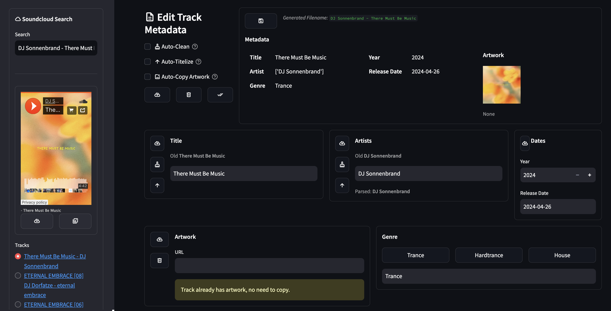

# soundcloud-tools ☁️

This repository provides a collection of tools to interact with the SoundCloud API.

---

This includes a __workflow__ to collect all __liked, posted and reposted tracks__ and playlists of a users __favorited artists__ for the past week.

The worlkflow is meant to be run weekly, and will store the tracks and playlists in a new playlist on the users SoundCloud account.

---

Another tool is the __MetaEditor__, which allows you to edit the metadata of your local tracks, including the artwork. The editor offers an integrated Soundcloud search to find the correct metadata for your tracks.

## Installation

```bash
pip install poetry
poetry install
```


## Settings

The following environment variables are required and can be set in a `.env` file in the root directory of the project:

```
OAUTH_TOKEN=
CLIENT_ID=
DATADOME_CLIENTID=
USER_ID=
PROXY=
```

## Tools

The following section describes the tools provided in this repository.

### MetaEditor

You can use the MetaEditor to edit the metadata of your local tracks.
It uses the `mutagen` library to edit the metadata of the tracks.
The editor offers an integrated Soundcloud search to find the correct metadata, including artwork, for your tracks.

```bash
poetry run streamlit run soundcloud_tools/streamlit/meta_editor.py   
```

Note that to optimize the workflow, the MetaEditor uses three folders to store the tracks:

- `root_folder/prepared`: This is the folder where you should store the tracks that you want to edit the metadata of.
- `root_folder/cleaned`: This is the folder where the MP3 tracks with the edited metadata will be stored.
- `root_folder/archive`: This is the folder where the original tracks will be stored after finishing the editing process. If the tracks are already in MP3 format, they will only be copied to the `cleaned` folder.

---

<picture>
  <source media="(prefers-color-scheme: dark)" srcset="assets/meta-editor.png-dark">
  <source media="(prefers-color-scheme: light)" srcset="assets/meta-editor-light.png">
  
</picture>

### Favorite Archiver

```bash
poetry run python soundcloud_tools
```

__Options__

- `--week`: The week number relative to the current week. For example, `--week=0` will download the tracks from the current week, `--week=-1` will download the tracks from the previous week, and so on.


In order to setup the workflow, simply add the environment variables as secrets in the GitHub repository settings. By default the workflow will run every Sunday at 08:00 AM, but this can be changed in the [`.github/workflows/run.yml`](.github/workflows/run.yml) file.
